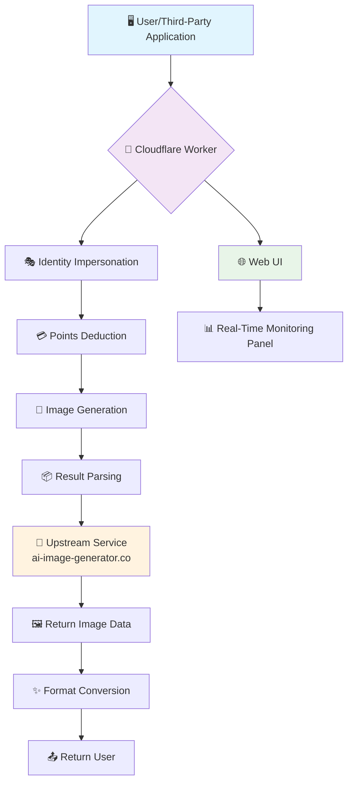

# 🎨 AI Generator Flux Pure (v2.4.0)

<div align="center">


**Minimalist and Pure AI Painting API Converter · Built for Flux Schnell Models · A Single-File Deployment Miracle**

> 🧠 **Philosophical Reflection**: In this era where code is thought, we are not only programmers, but also architects of thought. This project is an art of subtraction—stripping away complexity, returning to the core, and placing you just one API away from AI creativity.

[](https://deploy.workers.cloudflare.com/?url=https://github.com/iemabdullah/ai-generator-2api-cfwork)

[](https://github.com/iemabdullah/ai-generator-2api-cfwork)

</div>

---

## ✨ Core Features

<div align="center">

| 🚀 Ultimate Performance | 🎯 Precise Focus | 🔧 Intelligent Debugging |

|:---:|:---:|:---|

| **Single-File Architecture**<br>Extremely streamlined, high-efficiency operation | **Dedicated to Flux**<br>Deeply optimized for the best experience | **Transparent Logs**<br>Complete tracking, easy troubleshooting |


</div>

### 🎨 Feature Highlights

- **🚀 Pure Experience**: Focused on text-to-image processing, removing all redundant functions for maximum performance

- **🎯 Model Locking**: Deeply optimized for `flux-schnell`, eliminating selection difficulties

- **🔍 Deep Perspective**: A brand-new developer dashboard for real-time monitoring of the entire request chain

- **⚡️ One-Click Deployment**: Zero-configuration deployment with Cloudflare Workers, online in 5 minutes

- **💎 Cost Optimization**: Intelligently utilizes upstream services to achieve near-zero-cost AI painting

---

## 🏗️ Architecture Overview

<div align="center">



</div>

---
## 🚀 Quick Start

### Option 1: One-Click Deployment (Recommended)

<div align="center">

[](https://deploy.workers.cloudflare.com/?url=https://github.com/iemabdullah/ai-generator-2api-cfwork)

</div>

**Deployment Steps:**

1. **Click the button above** → Log in to your Cloudflare account

2. **Name your project** → For example, `my-ai-painter`

3. **Configure environment variables**:

- Go to Worker Settings → Variables

- Add `API_MASTER_KEY` (your access key)

- **Important**: Click 🔒 Encrypt button

4. **Save Deployment** → Done! 🎉

Your API address: `https://my-ai-painter.your-subdomain.workers.dev`

### Option Two: Manual Deployment

```bash

# Clone the project
git clone https://github.com/iemabdullah/ai-generator-2api-cfwork.git
cd ai-generator-2api-cfwork

# Install Wrangler CLI
npm install -g wrangler

# Log in to Cloudflare
wrangler login

# Deploy the project
wrangler deploy

```

---

## 🎮 Usage Guide

### 1. 🌐 Developer Dashboard (Web UI)

Directly access your Worker address to experience full functionality:

```
https://your project name.your subdomain.workers.dev

```

**Features:**

- 🎛️ **Real-time parameter adjustment** - One-click configuration of prompts and image ratios

- 👁️ **Request Transparency** - Complete tracking of every step from spoofing to generation

- 🎨 **Instant Preview** - Real-time display of generated results

- 📝 **Intelligent Logs** - Detailed debugging information, worry-free problem localization

### 2. 🤖 Integrating with Third-Party Applications

Taking **ChatGPT-Next-Web** as an example:

```yaml

# Configuration Example
API Address: https://your project name.your subdomain.workers.dev/v1
API Key: API_MASTER_KEY set in your environment variables
Model Selection: flux-schnell

```

**Configuration Steps:**

1. Open ChatGPT-Next-Web settings

2. Fill in the above configuration information

3. Select the `flux-schnell` model

4. Enter a prompt such as "Astronaut cat drinking coffee on the moon" 🐱👨‍🚀🌕☕

---

## 🔧 In-depth Technical Analysis

### Core Architecture Flow

```mermaid

sequenceDiagram

partner U as User

partner W as Worker

partner S as Upstream Service

U->>W: 📨 OpenAI Format Request

Note over W: 🎭 Identity Impersonation Stage

W->>W: generateFingerprint()

W->>W: generateRandomIP()

W->>W: getFakeHeaders()

Note over W: 🔄 Upstream Interaction Stage

W->>S: 💳 Points Deduction Request

S-->>W: Points Confirmation

W->>S: 🎨 Send Drawing Instruction

S-->>W: Return Image Data

Note over W: ✨ Format Conversion

W->>W: Convert to OpenAI Format

W-->>U: 📤 Return Standardized Response

```

### 🧩 Core Module Details

| Module | Technical Implementation | Difficulty | Function Description |

|------|----------|------|----------|

| **🎭 Identity Forgery** | `generateFingerprint()`<br>`generateRandomIP()` | ⭐⭐☆ | Simulates real user fingerprints and IP addresses to bypass basic risk control |

| **💳 Points Management** | `/api/credits/deduct` | ⭐☆☆ | Pre-deduct points mechanism to ensure service availability |

| **🎨 Image Generation** | `FormData` + Multipart | ⭐⭐☆ | Constructs the form data format required by upstream services |

| **📊 Log System** | `Logger` class + real-time streaming | ⭐⭐⭐ | Object-oriented logging, supporting real-time debugging and display |

| **🔄 Streaming Response** | `TransformStream` API | ⭐⭐⭐⭐ | Implements a ChatGPT-like streaming output experience |

### 💻 Code Structure

```
ai-generator-flux-pure.js

├── 🏗️ Core Configuration (CONFIG)

│ ├── Upstream Service Endpoints

│ ├── Model Parameter Presets

│ └── Response Template Definition

├── 🔀 Request Routing (fetch)

│ ├── CORS Preprocessing

│ ├── Web UI Routing

│ └── API Endpoint Distribution

├── 🎯 Business Logic

│ ├── Logger Class 📝

│ ├── performUpstreamGeneration 🚀

│ ├── handleChatCompletions 💬

│ └── handleImageGenerations 🖼️

├── 🛠️ Utility Functions

│ ├—— Authentication Verification

│ ├—— Error Handling

│ └—— Response Construction

└── 🌐 Web Interface

└── Server-Side UI Rendering

```

---

## 🚀 Advanced Features

### 🔐 Security Configuration

```javascript

// Environment Variable Configuration Example
API_MASTER_KEY = "sk-your-secret-key-here" // Access Key
ENABLE_RATE_LIMIT = true // Rate Limiting
MAX_REQUESTS_PER_MINUTE = 10 // Frequency Control

```

### 📊 Monitoring Metrics

- ✅ Request Success Rate Monitoring

- ⏱️ Response Time Tracking

- 🖼️ Number of Generated Images Statistics

- 🔄 Upstream Service Status Check

---

## 🛠️ Troubleshooting

### Common Problem Solutions

| Problem Description | Possible Causes | Solution |

|---------|----------|----------|

| 🚫 401 Authentication Failure | API Key Error | Check the environment variable `API_MASTER_KEY` configuration |

| 🐢 Response Timeout | Upstream Service Delay | Adjust Timeout Settings or Retry Mechanism |

| 💸 Insufficient Credits | Upstream Quota Exhausted | Wait for Quota Reset or Change Account |

| 🔄 Format Error | Request Format Mismatch | Verify OpenAI Compatibility Settings |

### 🔍 Debugging Techniques

1. **Use the Developer Dashboard** - View the complete request chain in real time

2. **Check Network Logs** - Analyze upstream service responses

3. **Verify Environment Variables** - Confirm configuration correctness

4. **Monitor Resource Usage** - Ensure sufficient Worker quota

---

## 🌟 Project Evolution Roadmap

<div align="center">

| Version | Status | Core Features | Technological Breakthroughs |

|:---:|:---:|:---|:---|

| **v1.0** | ✅ Completed | Basic API Forwarding | Proof of Concept |

| **v2.0** | ✅ Completed | Multi-Model Support | Feature Expansion |

| **v2.4** | 🎯 **Current** | **Flux Pure Version** | Streamlined Architecture |

| **v3.0** | 🚧 Plans | Intelligent Fault Tolerance + Dynamic Configuration | Improved Robustness |

| **v4.0** | 🌌 Vision | Multi-Source Adaptation + Plug-in | Ecosystem Expansion |

</div>

### 🎯 Future Plans

- **🔧 Intelligent Fault Tolerance Mechanism** - Automatic Recovery from Upstream Anomalies

- **📈 Dynamic Configuration System** - Hot Updates Without Redeployment - **🌐 Multi-Source Support** - Adapts to more AI painting services

- **🔌 Plugin-based Architecture** - Modular extensibility

---

## 🤝 Contribution Guidelines

We welcome all forms of contribution! Whether it's code improvement, documentation enhancement, or creative ideas.

### 💡 How to Participate

1. **Fork the Project** - Create your own copy

2. **Feature Development** - Implement new features or fix issues

3. **Testing and Verification** - Ensure code quality

4. **Submit a PR** - Share your improvements

### 🎯 Urgently Needed Contributions

- 🔧 Bug Handling Optimization

- 📚 Documentation Enhancement

- 🧪 Test Case Writing

- 🌍 Multi-Language Support

> **Open Source Spirit**: Every contribution, no matter how small, adds value to the technical community. Let's build a better open source ecosystem together! ✨

---

## 📄 License

This project is licensed under the **Apache License 2.0** open-source license.

**You are free to:**

- ✅ Use commercially

- ✅ Modify the code

- ✅ Distribute copies

- ✅ Use patents

**You need to:**

- 📝 Retain the copyright notice

- 📝 Disclose code changes

This is a business-friendly open-source license that encourages widespread adoption and innovation.
---

